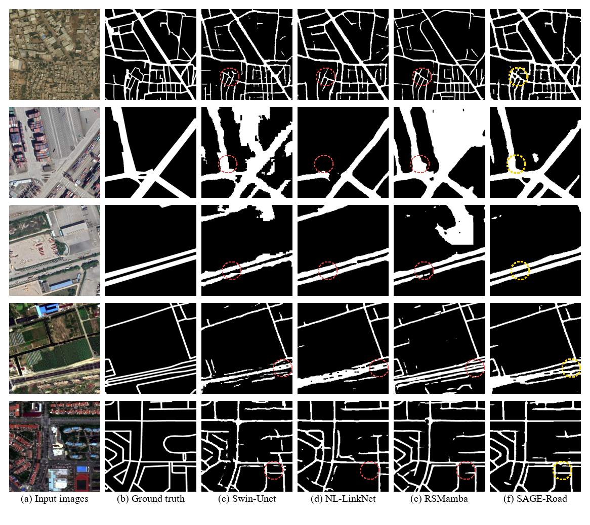

# SAGE-Road 🛣️ 🛰️

<div align="center">

**SAGE-Road: Road Extraction in Remote Sensing Images via Adaptive Feature Fusion and Edge-Assisted Decoding**

[]() 
[]()
[]()
[]()

</div>

> **Note to Reviewers:** 
> This repository is the official implementation for the paper **SAGE-Road**. The core network architecture is currently provided. The full training pipeline, evaluation scripts, and pre-trained weights are being cleaned up and will be officially released upon the acceptance of the paper.

---

## 📖 Introduction
Automated road extraction from high-resolution remote sensing imagery faces critical challenges such as dense canopy occlusions, building shadows, and extreme spectral similarity between concrete roofs and road surfaces. These factors often cause broken predictions and inaccurate boundaries. 

To address these topological and spectral bottlenecks, we propose **SAGE-Road**, a Swin-based road extraction network featuring:
1. **Hierarchical Swin Transformer** for long-range global context modeling.
2. **Gated Feature Pyramid Network (GFPN)** for adaptive multiplicative noise filtering and spectral confusion suppression.
3. **Edge-Assisted Decoder** for explicit forward structural injection, ensuring strict real-world topological connectivity.

## 🏗️ Architecture
SAGE-Road links the global receptive field with dynamic noise filtering and explicit structural reconstruction, achieving a superior balance between region accuracy and cartographic connectivity.

<div align="center">
  
</div>

*(Please upload your `figure1.png` to an `assets` folder in this repo and ensure the path matches above.)*

## 📊 Quantitative Results
SAGE-Road achieves state-of-the-art structural topology preservation across multiple benchmarks. Below are the comparative results on the **DeepGlobe** dataset (at 224×224 resolution). SAGE-Road delivers robust boundary (BF1) and topological (APLS) metrics without sacrificing regional accuracy.

| Method | Type | mIoU (%) | BF1 (%) | APLS (%) |
| :--- | :--- | :---: | :---: | :---: |
| SegFormer | General | 76.91 | 66.99 | 35.42 |
| SegNeXt | General | 77.48 | 72.53 | 60.32 |
| D-LinkNet | Road-Specific| 75.12 | 83.77 | 59.40 |
| RSMamba | Remote Sensing| **79.49** | 78.96 | 52.85 |
| **SAGE-Road (Ours)**| Road-Specific| 77.85 | **89.21** | **62.14** |

## 🖼️ Qualitative Results
Compared to recent baselines, SAGE-Road effectively bridges local gaps under complex backgrounds (e.g., tree canopies, container stacking) and maintains sharp parallel boundaries.

<div align="center">
  
</div>

*(Please upload a showcase image like your `Fig. 7` to the `assets` folder.)*

## 🚀 Release Plan (To-Do List)
To facilitate verification and inspire future research within the remote sensing community, we will continuously update this repository:

- [x] Initial repository setup and README.
- [x] Release the core network implementations (`sage_road.py`).
- [ ] Release data pre-processing and dynamic augmentation scripts (Upon Acceptance).
- [ ] Release the full training and evaluation pipeline (Upon Acceptance).
- [ ] Provide pre-trained weights for DeepGlobe, SpaceNet-3, and CHN6-CUG (Upon Acceptance).

## 📄 Citation
If you find our work or code useful for your research, please consider citing our paper:
```bibtex
@article{li2026sageroad,
  title={SAGE-Road: Road Extraction in Remote Sensing Images via Adaptive Feature Fusion and Edge-Assisted Decoding},
  author={Li, Jiahang and Yuan, Anran and Zhou, Ling and Li, Jianqing},
  journal={IEEE Transactions on Geoscience and Remote Sensing},
  note={Under Review},
  year={2026}
}
